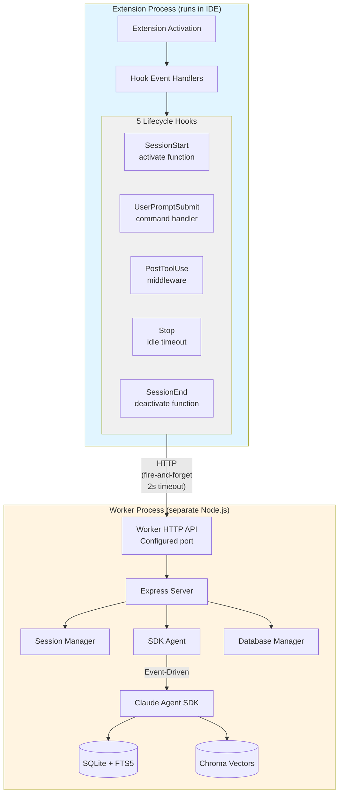
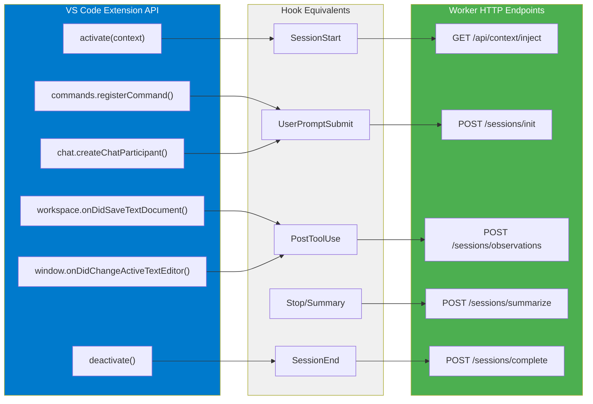
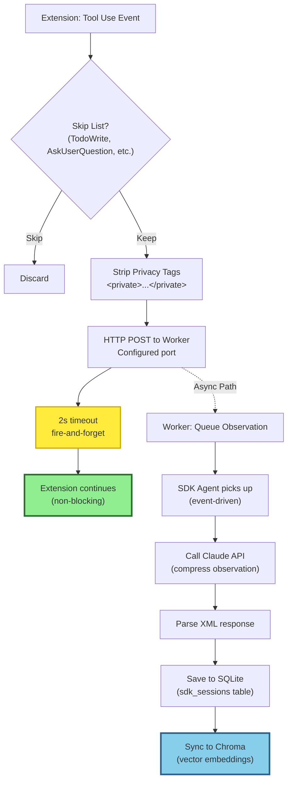
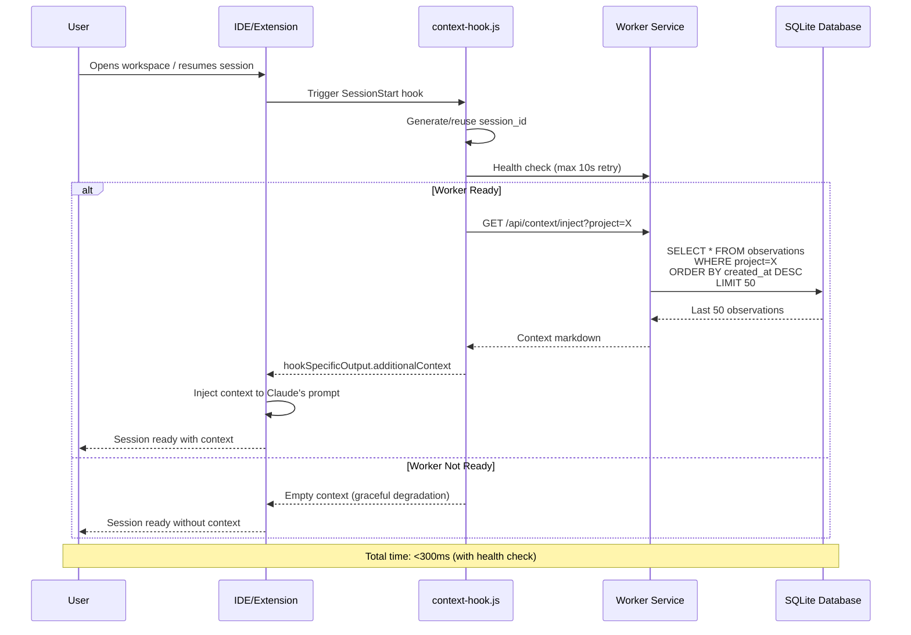
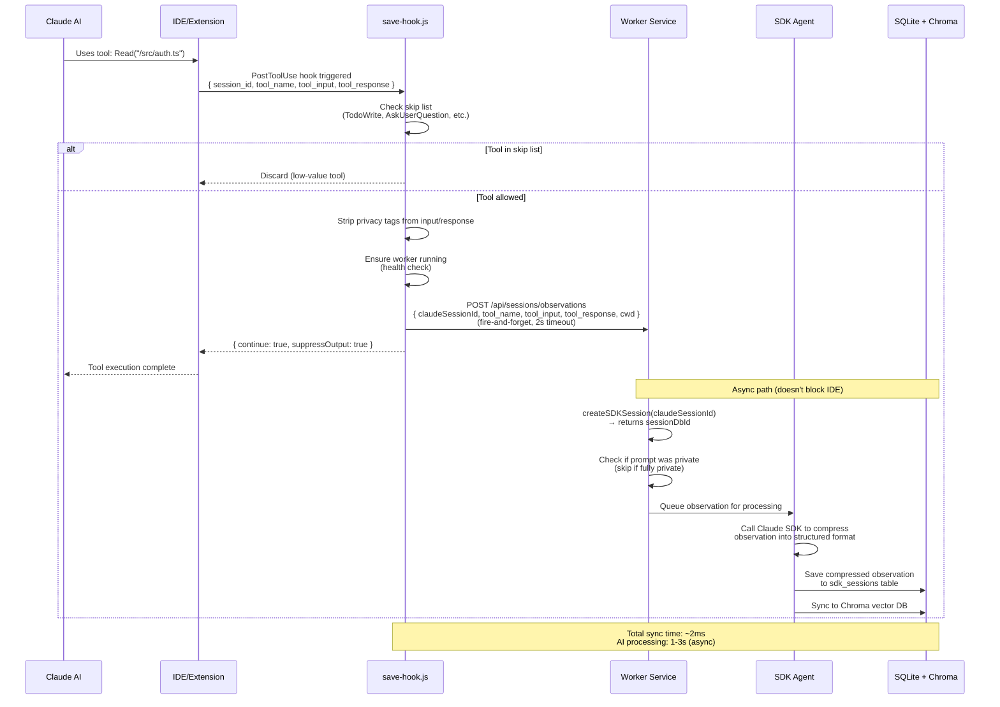
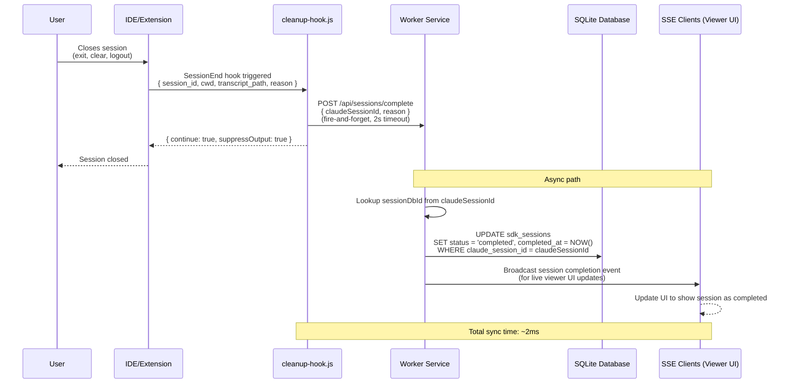
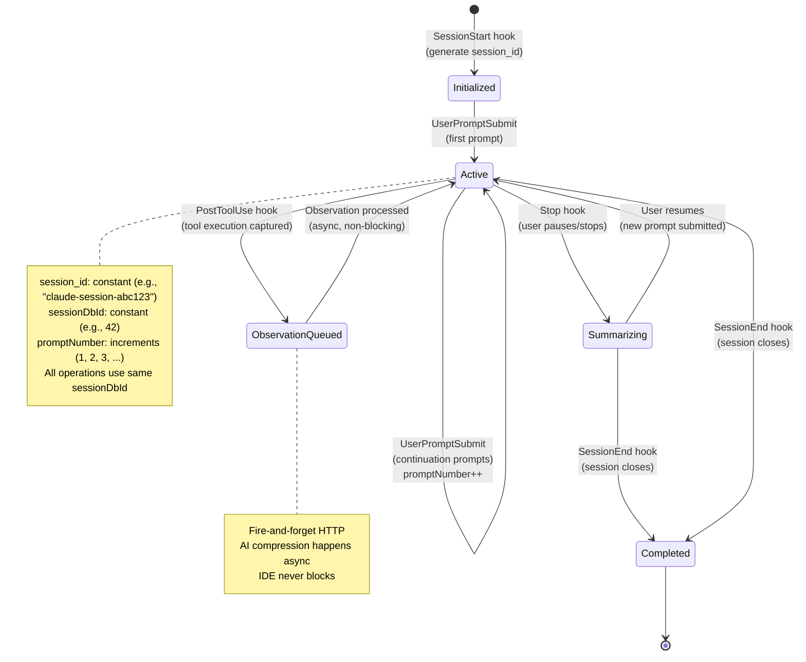
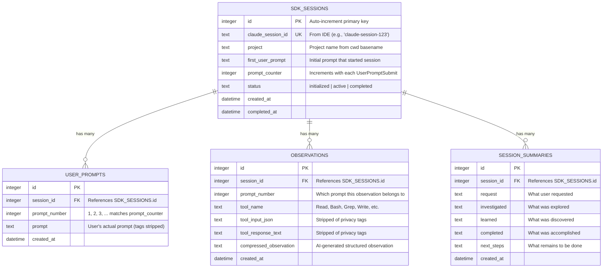

# Hook 生命周期

Claude-Mem 实现了一套 **5 阶段 Hook 系统**，用于跨 Claude Code 会话捕获开发工作。本文档为在其他平台上实现这一模式的开发者提供完整的技术参考。

## 架构总览

### 系统架构

这一双进程架构在 Claude Code 与 VS Code 中均可工作：



**关键原则**：
- 扩展进程永不阻塞（fire-and-forget HTTP）
- worker 异步处理观察记录
- 会话状态在 IDE 重启后依然保留

### VS Code 扩展 API 的接入点

对于要移植到 VS Code 的开发者，以下是接入 VS Code 扩展 API 的位置：



**实现示例**：

```typescript
const workerPort = process.env.CLAUDE_MEM_WORKER_PORT ?? "<worker-port>"
const workerBaseUrl = `http://127.0.0.1:${workerPort}`

// VS Code Extension - SessionStart Hook
export async function activate(context: vscode.ExtensionContext) {
  const sessionId = generateSessionId()
  const project = workspace.name || 'default'

  // Fetch context from worker
  const response = await fetch(`${workerBaseUrl}/api/context/inject?project=${project}`)
  const context = await response.text()

  // Inject into chat or UI panel
  injectContextToChat(context)
}

// VS Code Extension - UserPromptSubmit Hook
const command = vscode.commands.registerCommand('extension.command', async (prompt) => {
  await fetch(`${workerBaseUrl}/sessions/init`, {
    method: 'POST',
    body: JSON.stringify({ sessionId, project, userPrompt: prompt })
  })
})

// VS Code Extension - PostToolUse Hook (middleware pattern)
workspace.onDidSaveTextDocument(async (document) => {
  await fetch(`${workerBaseUrl}/api/sessions/observations`, {
    method: 'POST',
    body: JSON.stringify({
      claudeSessionId: sessionId,
      tool_name: 'FileSave',
      tool_input: { path: document.uri.path },
      tool_response: 'File saved successfully'
    })
  })
})
```

### 异步处理管线

观察记录如何在不阻塞 IDE 的情况下，从扩展流入数据库：



**关键模式**：扩展的 HTTP 调用设置 2 秒超时，不等待 AI 处理完成。worker 通过事件驱动队列异步完成压缩。

## 5 个生命周期阶段

| 阶段 | Hook | 触发时机 | 用途 |
|-------|------|---------|---------|
| **1. SessionStart** | `context-hook.js` | 用户打开 Claude Code | 静默注入此前上下文 |
| **2. UserPromptSubmit** | `new-hook.js` | 用户提交提问 | 创建/获取会话、保存提问、初始化 worker |
| **3. PostToolUse** | `save-hook.js` | Claude 使用任意工具 | 将观察记录排队等待 AI 压缩 |
| **4. Stop** | `summary-hook.js` | 用户停止提问 | 生成会话摘要 |
| **5. SessionEnd** | `cleanup-hook.js` | 会话关闭 | 将会话标记为已完成 |

## Hook 配置

Hook 配置在 `plugin/hooks/hooks.json` 中：

```json
{
  "hooks": {
    "Setup": [{
      "hooks": [{
        "type": "command",
        "command": "node ${CLAUDE_PLUGIN_ROOT}/scripts/version-check.js",
        "timeout": 60
      }]
    }],
    "SessionStart": [{
      "matcher": "startup|clear|compact",
      "hooks": [{
        "type": "command",
        "command": "bun ${CLAUDE_PLUGIN_ROOT}/scripts/worker-service.cjs start",
        "timeout": 60
      }, {
        "type": "command",
        "command": "bun ${CLAUDE_PLUGIN_ROOT}/scripts/context-hook.js",
        "timeout": 60
      }]
    }],
    "UserPromptSubmit": [{
      "hooks": [{
        "type": "command",
        "command": "node ${CLAUDE_PLUGIN_ROOT}/scripts/new-hook.js",
        "timeout": 120
      }]
    }],
    "PostToolUse": [{
      "matcher": "*",
      "hooks": [{
        "type": "command",
        "command": "node ${CLAUDE_PLUGIN_ROOT}/scripts/save-hook.js",
        "timeout": 120
      }]
    }],
    "Stop": [{
      "hooks": [{
        "type": "command",
        "command": "node ${CLAUDE_PLUGIN_ROOT}/scripts/summary-hook.js",
        "timeout": 120
      }]
    }],
    "SessionEnd": [{
      "hooks": [{
        "type": "command",
        "command": "node ${CLAUDE_PLUGIN_ROOT}/scripts/cleanup-hook.js",
        "timeout": 120
      }]
    }]
  }
}
```

---

## 阶段 1：SessionStart

**触发时机**：用户打开 Claude Code 或恢复会话

**触发的 Hook**（按顺序）：
1. `worker-service.cjs start` —— 启动 worker 服务
2. `context-hook.js` —— 获取并静默注入此前会话的上下文

（运行时安装由 `npx claude-mem install` / `npx claude-mem repair` 处理。Setup 阶段会运行 `version-check.js`：在插件依赖缺失时进行安装，安装完成后写入 `.install-version` 标记；只有当依赖仍然缺失时，才会提请您运行 `npx claude-mem@latest install`。）

<Note>
自 Claude Code 2.1.0（ultrathink 更新）起，SessionStart Hook 不再显示用户可见的消息。上下文改为通过 `hookSpecificOutput.additionalContext` 静默注入。
</Note>

### 时序图



### 上下文 Hook（`context-hook.js`）

**用途**：把此前会话的上下文注入到 Claude 的初始上下文中。

**输入**（经 stdin）：
```json
{
  "session_id": "claude-session-123",
  "cwd": "/path/to/project",
  "source": "startup"
}
```

**处理流程**：
1. 等待 worker 可用（健康检查，最长 10 秒）
2. 调用：`GET http://127.0.0.1:<worker-port>/api/context/inject?project={project}`
3. 以 `hookSpecificOutput` 中的 `additionalContext` 返回格式化后的上下文

**输出**（经 stdout）：
```json
{
  "hookSpecificOutput": {
    "hookEventName": "SessionStart",
    "additionalContext": "<<formatted context markdown>>"
  }
}
```

**实现位置**：`src/hooks/context-hook.ts`

---

## 阶段 2：UserPromptSubmit

**触发时机**：用户在会话中提交任意提问

**Hook**：`new-hook.js`

### 时序图

```mermaid
sequenceDiagram
    participant User
    participant IDE as IDE/Extension
    participant NewHook as new-hook.js
    participant DB as Direct SQLite Access
    participant Worker as Worker Service

    User->>IDE: Submits prompt: "Add login feature"
    IDE->>NewHook: Trigger UserPromptSubmit<br/>{ session_id, cwd, prompt }

    NewHook->>NewHook: Extract project = basename(cwd)
    NewHook->>NewHook: Strip privacy tags<br/>&lt;private&gt;...&lt;/private&gt;

    alt Prompt fully private (empty after stripping)
        NewHook-->>IDE: Skip (don't save)
    else Prompt has content
        NewHook->>DB: INSERT OR IGNORE INTO sdk_sessions<br/>(claude_session_id, project, first_user_prompt)
        DB-->>NewHook: sessionDbId (new or existing)

        NewHook->>DB: UPDATE sdk_sessions<br/>SET prompt_counter = prompt_counter + 1<br/>WHERE id = sessionDbId
        DB-->>NewHook: promptNumber (e.g., 1 for first, 2 for continuation)

        NewHook->>DB: INSERT INTO user_prompts<br/>(session_id, prompt_number, prompt)

        NewHook->>Worker: POST /sessions/{sessionDbId}/init<br/>{ project, userPrompt, promptNumber }<br/>(fire-and-forget, 2s timeout)
        Worker-->>NewHook: 200 OK (or timeout)

        NewHook-->>IDE: { continue: true, suppressOutput: true }
        IDE-->>User: Prompt accepted
    end

    Note over NewHook,DB: Idempotent: Same session_id → same sessionDbId
```

**关键模式**：`INSERT OR IGNORE` 保证相同的 `session_id` 始终映射到相同的 `sessionDbId`，从而支持会话续接。

**输入**（经 stdin）：
```json
{
  "session_id": "claude-session-123",
  "cwd": "/path/to/project",
  "prompt": "User's actual prompt text"
}
```

**处理步骤**：

```typescript
// 1. Extract project name from working directory
project = path.basename(cwd)

// 2. Create or get database session (IDEMPOTENT)
sessionDbId = db.createSDKSession(session_id, project, prompt)
// INSERT OR IGNORE: Creates new row if first prompt, returns existing if continuation

// 3. Increment prompt counter
promptNumber = db.incrementPromptCounter(sessionDbId)
// Returns 1 for first prompt, 2 for continuation, etc.

// 4. Strip privacy tags
cleanedPrompt = stripMemoryTags(prompt)
// Removes <private>...</private> and <claude-mem-context>...</claude-mem-context>

// 5. Skip if fully private
if (!cleanedPrompt || cleanedPrompt.trim() === '') {
  return  // Don't save, don't call worker
}

// 6. Save user prompt to database
db.saveUserPrompt(session_id, promptNumber, cleanedPrompt)

// 7. Initialize session via worker HTTP
POST http://127.0.0.1:<worker-port>/sessions/{sessionDbId}/init
Body: { project, userPrompt, promptNumber }
```

**输出**：
```json
{ "continue": true, "suppressOutput": true }
```

**实现位置**：`src/hooks/new-hook.ts`

<Note>
同一个 `session_id` 会贯穿一次对话中的所有 Hook。`createSDKSession` 调用是幂等的——续接提问会返回已存在的会话。
</Note>

---

## 阶段 3：PostToolUse

**触发时机**：Claude 使用任意工具之后（Read、Bash、Grep、Write 等）

**Hook**：`save-hook.js`

### 时序图



**关键模式**：Hook 在 HTTP POST 发出后立即返回。AI 压缩由 worker 异步完成，不会阻塞 Claude 的工具执行。

**输入**（经 stdin）：
```json
{
  "session_id": "claude-session-123",
  "cwd": "/path/to/project",
  "tool_name": "Read",
  "tool_input": { "file_path": "/src/index.ts" },
  "tool_response": "file contents..."
}
```

**处理步骤**：

```typescript
// 1. Check blocklist - skip low-value tools
const SKIP_TOOLS = {
  'ListMcpResourcesTool',  // MCP infrastructure noise
  'SlashCommand',          // Command invocation
  'Skill',                 // Skill invocation
  'TodoWrite',             // Task management meta-tool
  'AskUserQuestion'        // User interaction
}

if (SKIP_TOOLS[tool_name]) return

// 2. Ensure worker is running
await ensureWorkerRunning()

// 3. Send to worker (fire-and-forget HTTP)
POST http://127.0.0.1:<worker-port>/api/sessions/observations
Body: {
  claudeSessionId: session_id,
  tool_name,
  tool_input,
  tool_response,
  cwd
}
Timeout: 2000ms
```

**worker 处理流程**：
1. 查找或创建会话：`createSDKSession(claudeSessionId, '', '')`
2. 读取提问计数器
3. 隐私检查（若用户提问完全私密则跳过）
4. 从 `tool_input` 和 `tool_response` 中剥离记忆标签
5. 将观察记录加入 SDK 智能体的处理队列
6. SDK 智能体调用 Claude，将观察记录压缩为结构化格式
7. 将观察记录存入数据库，并同步至 Chroma

**输出**：
```json
{ "continue": true, "suppressOutput": true }
```

**实现位置**：`src/hooks/save-hook.ts`

---

## 阶段 4：Stop

**触发时机**：用户停止或暂停提问

**Hook**：`summary-hook.js`

### 时序图

```mermaid
sequenceDiagram
    participant User
    participant IDE as IDE/Extension
    participant SummaryHook as summary-hook.js
    participant Worker as Worker Service
    participant Agent as SDK Agent
    participant DB as SQLite Database

    User->>IDE: Stops asking questions<br/>(pause, idle, or explicit stop)
    IDE->>SummaryHook: Stop hook triggered<br/>{ session_id, cwd, transcript_path }

    SummaryHook->>SummaryHook: Read transcript JSONL file
    SummaryHook->>SummaryHook: Extract last user message<br/>(type: "user")
    SummaryHook->>SummaryHook: Extract last assistant message<br/>(type: "assistant", filter &lt;system-reminder&gt;)

    SummaryHook->>Worker: POST /api/sessions/summarize<br/>{ claudeSessionId, last_user_message, last_assistant_message }<br/>(fire-and-forget, 2s timeout)

    SummaryHook-->>IDE: { continue: true, suppressOutput: true }
    IDE-->>User: Session paused/stopped

    Note over Worker,DB: Async path

    Worker->>Worker: Lookup sessionDbId from claudeSessionId
    Worker->>Agent: Queue summarization request
    Agent->>Agent: Call Claude SDK with prompt:<br/>"Summarize: request, investigated, learned, completed, next_steps"
    Agent->>Agent: Parse XML response
    Agent->>DB: INSERT INTO session_summaries<br/>{ session_id, request, investigated, learned, completed, next_steps }
    Agent->>DB: Sync to Chroma (for semantic search)

    Note over SummaryHook,DB: Total sync time: ~2ms<br/>AI summarization: 2-5s (async)
```

**关键模式**：摘要异步生成，不会阻碍用户继续工作或关闭会话。

**输入**（经 stdin）：
```json
{
  "session_id": "claude-session-123",
  "cwd": "/path/to/project",
  "transcript_path": "/path/to/transcript.jsonl"
}
```

**处理步骤**：

```typescript
// 1. Extract last messages from transcript JSONL
const lines = fs.readFileSync(transcript_path, 'utf-8').split('\n')
// Find last user message (type: "user")
// Find last assistant message (type: "assistant", filter <system-reminder> tags)

// 2. Ensure worker is running
await ensureWorkerRunning()

// 3. Send summarization request (fire-and-forget HTTP)
POST http://127.0.0.1:<worker-port>/api/sessions/summarize
Body: {
  claudeSessionId: session_id,
  last_user_message: string,
  last_assistant_message: string
}
Timeout: 2000ms
```

<Note>
summary Hook 不会调用 `POST /api/processing`，该路由也不是一个 spinner 开关。它是一个仅限 localhost 的运维端重试入口：`{ "isProcessing": false }` 会为每一个缓冲了待处理工作且没有生成器在运行的活跃会话重启观察器，其中也包括自动恢复扫描不会触及的暂停情形，例如凭据被拒或传输失败。响应中的 `scheduledSessions` 报告本次重试的会话数量。`{ "isProcessing": true }` 会被接受，但不做任何事。
</Note>

**worker 处理流程**：
1. 将摘要任务加入 SDK 智能体的队列
2. 智能体调用 Claude 生成结构化摘要
3. 摘要连同字段存入数据库：`request`、`investigated`、`learned`、`completed`、`next_steps`

**输出**：
```json
{ "continue": true, "suppressOutput": true }
```

**实现位置**：`src/hooks/summary-hook.ts`

---

## 阶段 5：SessionEnd

**触发时机**：Claude Code 会话关闭（exit、clear、logout 等）

**Hook**：`cleanup-hook.js`

### 时序图



**关键模式**：会话完成状态用于统计与界面更新，但不会阻碍用户关闭 IDE。

**输入**（经 stdin）：
```json
{
  "session_id": "claude-session-123",
  "cwd": "/path/to/project",
  "transcript_path": "/path/to/transcript.jsonl",
  "reason": "exit"
}
```

**处理步骤**：

```typescript
// Send session complete (fire-and-forget HTTP)
POST http://127.0.0.1:<worker-port>/api/sessions/complete
Body: {
  claudeSessionId: session_id,
  reason: string  // 'exit' | 'clear' | 'logout' | 'prompt_input_exit' | 'other'
}
Timeout: 2000ms
```

**worker 处理流程**：
1. 按 `claudeSessionId` 查找会话
2. 将会话在数据库中标记为 'completed'
3. 向 SSE 客户端广播会话完成事件

**输出**：
```json
{ "continue": true, "suppressOutput": true }
```

**实现位置**：`src/hooks/cleanup-hook.ts`

---

## 会话状态机

理解会话生命周期与状态转换：



**关键要点**：
- `session_id` 在一次对话中从不改变
- `sessionDbId` 是该会话在数据库中的主键
- `promptNumber` 随每次用户提问递增
- 状态转换不阻塞（fire-and-forget 模式）

---

## 数据库模式

以会话为中心的数据模型，支撑跨会话记忆：



**幂等模式**：

```sql
-- This ensures same session_id always maps to same sessionDbId
INSERT OR IGNORE INTO sdk_sessions (claude_session_id, project, first_user_prompt)
VALUES (?, ?, ?)
RETURNING id;

-- If already exists, returns existing row
-- If new, creates and returns new row
```

**外键级联**：

所有子表（user_prompts、observations、session_summaries）都以 `session_id` 外键引用 `SDK_SESSIONS.id`。由此保证：
- 一个会话的全部数据都可按 sessionDbId 查询
- 删除会话会级联删除子表数据
- 上下文注入的高效联表查询

<Warning>
切勿自行生成会话 ID。始终使用 IDE 提供的 `session_id` —— 这是把所有数据串联起来的唯一事实来源。
</Warning>

---

## 隐私与标签剥离

### 双标签系统

```typescript
// User-Level Privacy Control (manual)
<private>sensitive data</private>

// System-Level Recursion Prevention (auto-injected)
<claude-mem-context>...</claude-mem-context>
```

### 处理管线

**位置**：`src/utils/tag-stripping.ts`

```typescript
// Called by: new-hook.js (user prompts) and save-hook.js (tool_input, tool_response)
stripMemoryTags(content: string): string
```

**执行顺序**（边缘处理）：
1. `new-hook.js` 在保存前对用户提问剥离标签
2. `save-hook.js` 在发送给 worker 前对工具数据剥离标签
3. worker 在入库前再次剥离标签（纵深防御）

---

## SDK Agent 处理

### 查询循环（事件驱动）

**位置**：`src/services/worker/SDKAgent.ts`

```typescript
async startSession(session: ActiveSession, worker?: any) {
  // 1. Create event-driven message generator
  const messageGenerator = this.createMessageGenerator(session)

  // 2. Run Agent SDK query loop
  const queryResult = query({
    prompt: messageGenerator,
    options: {
      model: 'claude-sonnet-5',
      disallowedTools: ['Bash', 'Read', 'Write', ...],  // Observer-only
      abortController: session.abortController
    }
  })

  // 3. Process responses
  for await (const message of queryResult) {
    if (message.type === 'assistant') {
      await this.processSDKResponse(session, text, worker)
    }
  }
}
```

### 消息类型

消息生成器会产出以下几类 prompt：

1. **初始 prompt**（第 1 条）：启动观察记录的完整指令
2. **续接 prompt**（第 2 条起）：仅含上下文，用于继续工作
3. **观察记录 prompt**：待压缩为观察记录的工具使用数据
4. **摘要 prompt**：待总结的会话数据

---

## 实现清单

仅供在其他平台上实现这一模式的开发者参考：

### Hook 注册
- [ ] 在平台配置中定义 Hook 入口
- [ ] 5 种 Hook：SessionStart（2 个）、UserPromptSubmit、PostToolUse、Stop、SessionEnd
- [ ] 传入 `session_id`、`cwd` 与上下文专属数据

### 数据库模式
- [ ] SQLite，启用 WAL 模式
- [ ] 4 张主表：`sdk_sessions`、`user_prompts`、`observations`、`session_summaries`
- [ ] 为常见查询建立索引

### worker 服务
- [ ] 在配置好的 worker 端口上运行 HTTP 服务
- [ ] 用 Bun 运行时做进程管理
- [ ] 3 个核心服务：SessionManager、SDKAgent、DatabaseManager

### Hook 实现
- [ ] context-hook：`GET /api/context/inject`（带健康检查）
- [ ] new-hook：createSDKSession、saveUserPrompt、`POST /sessions/{id}/init`
- [ ] save-hook：跳过低价值工具、`POST /api/sessions/observations`
- [ ] summary-hook：解析 transcript、`POST /api/sessions/summarize`
- [ ] cleanup-hook：`POST /api/sessions/complete`

### 隐私与标签
- [ ] 实现 `stripMemoryTags()`
- [ ] 在 Hook 层处理标签（边缘处理）
- [ ] 标签数量上限 100（防 ReDoS）

### SDK 集成
- [ ] 调用 Claude Agent SDK 处理观察记录/摘要
- [ ] 解析 XML 响应以得到结构化数据
- [ ] 存入数据库并同步至向量数据库

---

## 关键设计原则

1. **会话 ID 是唯一事实来源**：绝不自行生成会话 ID
2. **数据库操作幂等**：会话创建使用 `INSERT OR IGNORE`
3. **隐私边缘处理**：在数据到达 worker 之前，就在 Hook 层剥离标签
4. **fire-and-forget 实现非阻塞**：HTTP 超时避免 IDE 被阻塞
5. **事件驱动，而非轮询**：向 SDK 智能体零延迟通知队列
6. **一切都始终保存**：不存在"孤儿"会话

---

## 常见陷阱

| 问题 | 根因 | 解决方案 |
|---------|-----------|----------|
| Session ID 不一致 | 不同 Hook 用了不同的 `session_id` | 始终使用 Hook 输入中的 ID |
| 会话重复 | 新建会话而不复用已有会话 | 以 `session_id` 为键使用 `INSERT OR IGNORE` |
| 阻塞 IDE | 等待完整响应 | 采用短超时的 fire-and-forget |
| 数据库中残留记忆标签 | 在错误的层剥离标签 | 在 Hook 层（HTTP 发送之前）剥离 |
| 找不到 worker | 健康检查过快 | 增加带指数退避的重试循环 |

---

## 相关文档

- [Worker 服务](/architecture/worker-service) - HTTP API 与异步处理
- [数据库模式](/architecture/database) - SQLite 表与 FTS5 检索
- [隐私标签](/usage/private-tags) - `<private>` 标签的用法
- [故障排查](/troubleshooting) - 常见 Hook 问题
