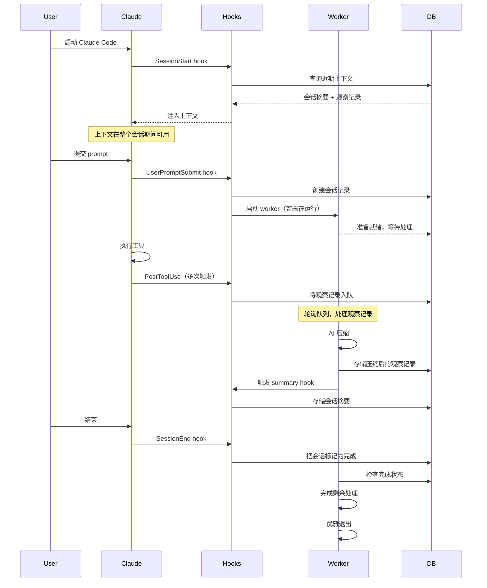

# Claude-Mem 如何使用 Hook：生命周期驱动的架构

## 核心原则
**从外部观察 Claude Code 主会话，在后台处理观察记录，在恰当的时机注入上下文。**

---

## 整体概览

Claude-Mem 本质上是一个 **hook 驱动系统**，所有功能都在响应生命周期事件时发生：

```
┌─────────────────────────────────────────────────────────┐
│              CLAUDE CODE SESSION                         │
│  (Main session - user interacting with Claude)          │
│                                                          │
│  SessionStart → UserPromptSubmit → Tool Use → Stop      │
│     ↓ ↓ ↓            ↓               ↓          ↓        │
│  [3 Hooks]        [Hook]          [Hook]     [Hook]     │
└─────────────────────────────────────────────────────────┘
    ↓ ↓ ↓             ↓               ↓          ↓
┌─────────────────────────────────────────────────────────┐
│                  CLAUDE-MEM SYSTEM                       │
│                                                          │
│  Smart      Worker      Context    New        Obs       │
│  Install    Start       Inject     Session    Capture   │
└─────────────────────────────────────────────────────────┘
```

<Note>
自 Claude Code 2.1.0（ultrathink 更新）起，SessionStart Hook 不再显示用户可见的消息。上下文通过 `hookSpecificOutput.additionalContext` 静默注入。
</Note>

**关键洞察**：Claude-Mem 不会打断或修改 Claude Code 的行为，而是从外部观察，通过生命周期 Hook 提供价值。

---

## 为什么选择 Hook？

### 非侵入性要求

Claude-Mem 有几条架构上的硬约束：

1. **不能修改 Claude Code**：它是闭源二进制程序
2. **必须快**：不能拖慢主会话
3. **必须可靠**：就算自身失败也不能弄坏 Claude Code
4. **必须可移植**：在任何项目上无需配置即可使用

**解决方案**：通过 settings.json 配置的外部命令 Hook

### Hook 系统的优势

Claude Code 的 hook 系统恰好提供了所需的能力：

<CardGroup cols={2}>
  <Card title="生命周期事件" icon="clock">
    SessionStart、UserPromptSubmit、PreToolUse（Read）、PostToolUse、PostToolUseFailure、Stop、SessionEnd
  </Card>

  <Card title="非阻塞" icon="forward">
    Hook 并行运行，不等待完成
  </Card>

  <Card title="上下文注入" icon="upload">
    SessionStart 与 UserPromptSubmit 可以添加上下文
  </Card>

  <Card title="工具观察" icon="eye">
    PostToolUse 能看到所有工具的输入与输出
  </Card>
</CardGroup>

---

## Hook 脚本

Claude-Mem 在 5 个生命周期事件上使用生命周期 hook 脚本。`npx claude-mem install`（以及 `npx claude-mem repair`）负责搭建运行时；Setup Hook 运行 `version-check.js`，为插件市场安装补齐缺失的依赖并写入安装标记。SessionStart 在 startup、resume、clear 和 compact 时异步运行 worker-service start。同步的上下文 Hook 在 startup、clear 和 compact 时运行，并在需要时自行启动 worker。continue 与 resume 恢复既有会话，不打印也不注入新的时间线，以保留其 prompt cache。

### Setup Hook：版本检查

**目的**：确保已加载的插件能启动它的 worker：补装插件市场遗漏的运行时依赖，并写入 `.install-version` 标记。

**注意**：`npx claude-mem install` 与 `npx claude-mem repair` 会预先装好 Bun、uv 以及插件依赖。插件市场（包括 `claude plugin update`）只负责解出文件，因此 Setup Hook 需要自行补齐缺失的依赖树。

**时机**：Claude Code 的 Setup 阶段，每次会话开始前。

**它做的事**：
1. 检查插件 `package.json` 中声明的每个依赖（外加 worker 加载的 `zod` 子路径）是否确实存在于其 `node_modules` 中，而不只是检查目录是否存在。
2. 若有缺失，在插件根目录运行 `bun install --production`（最长 120 秒），然后再次检查。不完整的依赖树会被保留，绝不删除。
3. 若依赖仍缺失，则打印 `claude-mem: plugin dependencies missing (…) - run: npx claude-mem@latest install`，指明缺失的模块（输出到 stderr；Codex 会将其作为 SessionStart 上下文接收）。
4. 若依赖闭包完整而 `.install-version` 缺失、不可读或来自其他版本，则自行写入该标记（`{version, installedAt, bun}`），而不是把一个完好的安装送去给安装器。
5. 总是以 0 退出——绝不阻塞会话。

**配置**（已简化；随包发布的命令会先解析插件根目录）：
```json
{
  "hooks": {
    "Setup": [{
      "hooks": [{
        "type": "command",
        "command": "node ${CLAUDE_PLUGIN_ROOT}/scripts/version-check.js",
        "timeout": 300
      }]
    }]
  }
}
```

**关键特性**：
- ✅ 安装完整时很快：只做声明依赖检查，不安装
- ✅ 自愈市场安装：补装缺失依赖并写入标记，因此完好的安装不会看到"请运行安装器"的提示
- ✅ 当安装无法完成时，指明缺失的模块
- ✅ 总是以 0 退出——绝不阻塞会话

**源码**：`plugin/scripts/version-check.js`。`npx claude-mem install` / `npx claude-mem repair` 提前完成同样的工作——全局安装 Bun + uv、在插件缓存中运行 `bun install`、写入 `.install-version` 标记——并配有可见的 clack 进度条。

---

### Hook 1：SessionStart——上下文注入

**目的**：从既往会话注入相关上下文

**时机**：新 Claude Code 会话启动时，或 clear、compact 之后（与异步启动 worker 的 SessionStart 条目并行运行）。continue 与 resume 时跳过。

**它做的事**：
1. 从当前工作目录提取项目名
2. 查询 SQLite 获取最近的会话摘要（最近 10 条）
3. 查询 SQLite 获取最近的观察记录（observation）（可配置，默认 50 条）
4. 将结果格式化为渐进式披露（progressive disclosure）索引
5. 输出到 stdout（自动注入上下文）

**关键决策**：
- ✅ 在 startup、clear 和 compact 时运行
- ✅ 300 秒超时（必要时允许 npm install）
- ✅ 渐进式披露格式（索引，而非完整细节）
- ✅ 通过 `CLAUDE_MEM_CONTEXT_OBSERVATIONS` 配置观察记录条数

**输出格式**：
```markdown
# [claude-mem] recent context

**Legend:** 🎯 session-request | 🔴 gotcha | 🟡 problem-solution ...

### Oct 26, 2025

**General**
| ID | Time | T | Title | Tokens |
|----|------|---|-------|--------|
| #2586 | 12:58 AM | 🔵 | Context hook file empty | ~51 |

*Use MCP search tools to access full details*
```

**源码**：`src/hooks/context-hook.ts` → `plugin/scripts/context-hook.js`

---

### Hook 2：UserPromptSubmit（新会话 Hook）

**目的**：在用户提交 prompt 时初始化会话跟踪

**时机**：Claude 处理用户消息之前

**它做的事**：
1. 从 stdin 读取用户 prompt 与 session ID
2. 在 SQLite 中创建新的会话记录
3. 保存原始用户 prompt 供全文检索使用（v4.2.0+）
4. 若 worker 服务未在运行则启动它
5. 立即返回（非阻塞）

**配置**：
```json
{
  "hooks": {
    "UserPromptSubmit": [{
      "hooks": [{
        "type": "command",
        "command": "${CLAUDE_PLUGIN_ROOT}/scripts/new-hook.js"
      }]
    }]
  }
}
```

**关键决策**：
- ✅ 不设 matcher（对所有 prompt 运行）
- ✅ 立即创建会话记录
- ✅ 保存原始 prompt 供检索（隐私说明：仅存本地 SQLite）
- ✅ 自动启动 worker 服务
- ✅ 抑制输出（`suppressOutput: true`）

**数据库操作**：
```sql
INSERT INTO sdk_sessions (claude_session_id, project, user_prompt, ...)
VALUES (?, ?, ?, ...)

INSERT INTO user_prompts (session_id, prompt, prompt_number, ...)
VALUES (?, ?, ?, ...)
```

**源码**：`src/hooks/new-hook.ts` → `plugin/scripts/new-hook.js`

---

### Hook 3：PostToolUse（保存观察记录 Hook）

**目的**：捕获工具执行产生的观察记录，供后续处理

**时机**：任一工具成功完成后立即触发。失败的调用（例如 Bash 以非零码退出）会改走 `PostToolUseFailure`，它运行同一个处理函数，并把 `{ error, is_interrupt }` 记录为工具输出，因此记忆也能看到失败过的尝试。

**它做的事**：
1. 从 stdin 接收工具名、输入与输出
2. 查找当前项目对应的活跃会话
3. 把观察记录加入 observation_queue 表
4. 立即返回（处理交给 worker）

**配置**：
```json
{
  "hooks": {
    "PostToolUse": [{
      "matcher": "*",
      "hooks": [{
        "type": "command",
        "command": "${CLAUDE_PLUGIN_ROOT}/scripts/save-hook.js"
      }]
    }]
  }
}
```

**关键决策**：
- ✅ matcher 为 `*`（捕获所有工具）
- ✅ 非阻塞（只入队，不处理）
- ✅ 观察记录由 worker 异步处理
- ✅ 并行执行安全（每个 Hook 拥有独立的 stdin）

**数据库操作**：
```sql
INSERT INTO observation_queue (session_id, tool_name, tool_input, tool_output, ...)
VALUES (?, ?, ?, ?, ...)
```

**入队的内容**：
```json
{
  "session_id": "abc123",
  "tool_name": "Edit",
  "tool_input": {
    "file_path": "/path/to/file.ts",
    "old_string": "...",
    "new_string": "..."
  },
  "tool_output": {
    "success": true,
    "linesChanged": 5
  },
  "created_at_epoch": 1698765432
}
```

**源码**：`src/hooks/save-hook.ts` → `plugin/scripts/save-hook.js`

---

### Hook 4：Stop Hook（生成会话摘要）

**目的**：在会话进行期间生成 AI 驱动的会话摘要

**时机**：Claude 停止时（由 Stop 生命周期事件触发）

**它做的事**：
1. 从数据库收集本会话的观察记录
2. 发送给 Claude Agent SDK 进行摘要
3. 处理响应并提取结构化摘要
4. 存入 session_summaries 表

**配置**：
```json
{
  "hooks": {
    "Stop": [{
      "hooks": [{
        "type": "command",
        "command": "${CLAUDE_PLUGIN_ROOT}/scripts/summary-hook.js"
      }]
    }]
  }
}
```

**关键决策**：
- ✅ 由 Stop 生命周期事件触发
- ✅ 每个会话可产出多份摘要（v4.2.0+）
- ✅ 摘要是检查点，不是终点
- ✅ 使用 Claude Agent SDK 完成 AI 压缩

**摘要结构**：
```xml
<summary>
  <request>User's original request</request>
  <investigated>What was examined</investigated>
  <learned>Key discoveries</learned>
  <completed>Work finished</completed>
  <next_steps>Remaining tasks</next_steps>
  <files_read>
    <file>path/to/file1.ts</file>
    <file>path/to/file2.ts</file>
  </files_read>
  <files_modified>
    <file>path/to/file3.ts</file>
  </files_modified>
  <notes>Additional context</notes>
</summary>
```

**源码**：`src/hooks/summary-hook.ts` → `plugin/scripts/summary-hook.js`

---

### Hook 5：SessionEnd（清理 Hook）

**目的**：在会话结束时把会话标记为已完成

**时机**：Claude Code 会话结束时（`/clear` 不触发）

**它做的事**：
1. 在数据库中把会话标记为已完成
2. 允许 worker 完成剩余处理
3. 执行优雅清理（graceful cleanup）

**配置**：
```json
{
  "hooks": {
    "SessionEnd": [{
      "hooks": [{
        "type": "command",
        "command": "${CLAUDE_PLUGIN_ROOT}/scripts/cleanup-hook.js"
      }]
    }]
  }
}
```

**关键决策**：
- ✅ 优雅完结（v4.1.0+）
- ✅ 不再向 worker 发送 DELETE
- ✅ `/clear` 命令时跳过清理
- ✅ 保留仍在进行的会话

**为什么要优雅清理？**

**旧方案（v3）：**
```typescript
// ❌ Aggressive cleanup
SessionEnd → DELETE /worker/session → Worker stops immediately
```

**问题：**
- 打断了摘要生成
- 丢失待处理的观察记录
- 产生竞态条件

**新方案（v4.1.0+）：**
```typescript
// ✅ Graceful completion
SessionEnd → UPDATE sessions SET completed_at = NOW()
Worker sees completion → Finishes processing → Exits naturally
```

**收益：**
- worker 能完成重要的操作
- 摘要顺利完成
- 状态切换干净利落

**源码**：`src/hooks/cleanup-hook.ts` → `plugin/scripts/cleanup-hook.js`

---
## Hook 执行流程

### 会话生命周期



### Hook 时序

| 事件 | 时机 | 是否阻塞 | 超时 | 输出处理 |
|-------|--------|----------|---------|-----------------|
| **Setup（version-check）** | 会话开始前 | 否 | 300s | 安装缺失的插件依赖；仅当依赖仍缺失时才在 stderr 给出提示（总是以 0 退出） |
| **SessionStart（worker-start）** | 会话启动（异步） | 否 | 60s | 仅 stderr（日志） |
| **SessionStart（context）** | 会话开始前 | 否 | 60s | JSON → additionalContext（静默） |
| **UserPromptSubmit** | 处理之前 | 否 | 15s（内部预算 10s；Windows 上为 7s） | stdout → 上下文 |
| **PostToolUse** | 工具完成后 | 否 | 120s | 仅记录到 transcript |
| **PostToolUseFailure** | 工具失败后 | 否 | 120s | 仅记录到 transcript |
| **Summary** | 由 worker 触发 | 否 | 120s | 数据库 |
| **SessionEnd** | 退出时 | 否 | 120s | 仅日志 |

<Note>
自 Claude Code 2.1.0（ultrathink 更新）起，SessionStart Hook 不再显示用户可见的消息。上下文通过 `hookSpecificOutput.additionalContext` 静默注入。
</Note>

---

## Worker 服务架构

### 为什么需要后台 worker？

**问题**：Hook 必须快（< 1 秒）

**现实**：AI 压缩每条观察记录要花 5-30 秒

**解决方案**：Hook 只负责把观察记录入队，worker 异步处理

```
┌─────────────────────────────────────────────────────────┐
│                   HOOK (Fast)                            │
│  1. Read stdin (< 1ms)                                  │
│  2. Insert into queue (< 10ms)                          │
│  3. Return success (< 20ms total)                       │
└─────────────────────────────────────────────────────────┘
                        ↓ (queue)
┌─────────────────────────────────────────────────────────┐
│                 WORKER (Slow)                            │
│  1. Poll queue every 1s                                 │
│  2. Process observation via Claude SDK (5-30s)          │
│  3. Parse and store results                             │
│  4. Mark observation processed                          │
└─────────────────────────────────────────────────────────┘
```

### Bun 进程管理

**技术选型**：Bun（JavaScript 运行时与进程管理器）

**为什么选 Bun：**
- 失败后自动重启
- 启动快、内存占用低
- 内置 TypeScript 支持
- 跨平台（macOS、Linux、Windows 均可）
- 无需单独的进程管理器

**worker 生命周期**：
```bash
# 由 hook 自动启动（若未在运行）
npm run worker:start

# 状态检查
npm run worker:status

# 查看日志
npm run worker:logs

# 重启
npm run worker:restart

# 停止
npm run worker:stop
```

### Worker HTTP API

**技术选型**：Express.js REST API，运行在 worker 的每用户端口上（默认 `37700 + (uid % 100)`，可通过 `CLAUDE_MEM_WORKER_PORT` 覆盖）

**端点：**

| Endpoint | Method | 用途 |
|----------|--------|---------|
| `/health` | GET | 健康检查 |
| `/sessions` | POST | 创建会话 |
| `/sessions/:id` | GET | 获取会话状态 |
| `/sessions/:id` | PATCH | 更新会话 |
| `/observations` | POST | 将观察记录入队 |
| `/observations/:id` | GET | 获取观察记录 |

**为什么用 HTTP API？**
- 与语言无关（hook 可以用任何语言编写）
- 便于调试（curl 命令）
- 标准化的错误处理
- 正确的异步处理

---

## 设计模式

### 模式 1：即发即忘的 Hook

**原则（fire-and-forget）**：Hook 应立即返回，不等待处理完成

```typescript
// ❌ Bad: Hook waits for processing
export async function saveHook(stdin: HookInput) {
  const observation = parseInput(stdin);
  await processObservation(observation);  // BLOCKS!
  return success();
}

// ✅ Good: Hook enqueues and returns
export async function saveHook(stdin: HookInput) {
  const observation = parseInput(stdin);
  await enqueueObservation(observation);  // Fast
  return success();  // Immediate
}
```

### 模式 2：基于队列的处理

**原则**：将捕获与处理解耦

```
Hook（捕获）→ Queue（缓冲）→ Worker（处理）
```

**收益：**
- Hook 并行执行是安全的
- worker 失败不影响 hook
- 重试逻辑集中在一处
- 支持背压处理

### 模式 3：优雅降级

**原则**：记忆系统失败不应弄坏 Claude Code

```typescript
try {
  await captureObservation();
} catch (error) {
  // Log error, but don't throw
  console.error('Memory capture failed:', error);
  return { continue: true, suppressOutput: true };
}
```

**失败模式：**
- 数据库被锁 → 跳过这条观察记录，记录错误
- worker 崩溃 → 由 Bun 自动重启
- 网络问题 → 指数退避重试
- 磁盘已满 → 提醒用户，禁用记忆功能

### 模式 4：渐进增强

**原则**：核心功能在没有记忆的情况下照常工作，记忆只是增强它

```
无记忆时：Claude Code 正常工作
有记忆时：Claude Code + 来自过去会话的上下文
记忆失效：回退为正常工作
```

---
## Hook 调试

### 调试模式

启用详细的 Hook 执行日志：

```bash
claude --debug
```

**输出：**
```
[DEBUG] Executing hooks for PostToolUse:Write
[DEBUG] Getting matching hook commands for PostToolUse with query: Write
[DEBUG] Found 1 hook matchers in settings
[DEBUG] Matched 1 hooks for query "Write"
[DEBUG] Found 1 hook commands to execute
[DEBUG] Executing hook command: ${CLAUDE_PLUGIN_ROOT}/scripts/save-hook.js with timeout 60000ms
[DEBUG] Hook command completed with status 0: {"continue":true,"suppressOutput":true}
```

### 常见问题

<AccordionGroup>
  <Accordion title="Hook 没有执行">
    **症状**：Hook 命令从未运行

    **排查**：
    1. 查看 `/hooks` 菜单——Hook 是否已注册？
    2. 核对 matcher 模式（大小写敏感！）
    3. 手动测试命令：`echo '{}' | node save-hook.js`
    4. 检查文件权限（是否可执行？）
  </Accordion>

  <Accordion title="Hook 超时">
    **症状**：Hook 执行超出超时上限

    **排查**：
    1. 检查超时设置（默认 60s）
    2. 找出慢在哪一环（数据库？网络？）
    3. 把慢操作挪到 worker
    4. 必要时调大超时
  </Accordion>

  <Accordion title="上下文没有注入">
    **症状**：SessionStart Hook 已运行但上下文缺失

    **排查**：
    1. 检查 stdout（必须是合法 JSON 或纯文本）
    2. 确认没有 stderr 输出（会污染 JSON）
    3. 检查退出码（必须为 0）
    4. 查找是否有 npm install 的输出（v4.3.1 已修复）
  </Accordion>

  <Accordion title="观察记录没有被捕获">
    **症状**：PostToolUse Hook 已运行但观察记录缺失

    **排查**：
    1. 检查数据库：`sqlite3 ~/.claude-mem/claude-mem.db "SELECT * FROM observation_queue"`
    2. 确认会话存在：`SELECT * FROM sdk_sessions`
    3. 查看 worker 状态：`npm run worker:status`
    4. 查看 worker 日志：`npm run worker:logs`
  </Accordion>
</AccordionGroup>

### 手动测试 Hook

```bash
# 测试上下文 hook
echo '{
  "session_id": "test123",
  "cwd": "/Users/alex/projects/my-app",
  "hook_event_name": "SessionStart",
  "source": "startup"
}' | node plugin/scripts/context-hook.js

# 测试保存 hook
echo '{
  "session_id": "test123",
  "tool_name": "Edit",
  "tool_input": {"file_path": "test.ts"},
  "tool_output": {"success": true}
}' | node plugin/scripts/save-hook.js

# 用真实的 Claude Code 测试
claude --debug
/hooks  # 查看已注册的 hook
# 提交一个 prompt，然后观察 debug 输出
```

---

## 性能考量

### Hook 执行耗时

**目标**：每个 Hook < 100ms

**实测数据：**

| Hook | 平均值 | p95 | p99 |
|------|---------|-----|-----|
| Setup（version-check，依赖完整，标记为当前版本） | 8ms | 20ms | 40ms |
| SessionStart（context） | 45ms | 120ms | 250ms |
| SessionStart（user-message） | 5ms | 10ms | 15ms |
| UserPromptSubmit | 12ms | 25ms | 50ms |
| PostToolUse | 8ms | 15ms | 30ms |
| SessionEnd | 5ms | 10ms | 20ms |

**Setup Hook 何时快、何时不快：**
- 依赖树完整时，它只检查声明的模块能否解析，并在 `.install-version` 标记缺失或属于其他版本时重写该标记——不安装。
- 只有依赖树不完整——插件市场安装或 `claude plugin update` 从未装过依赖——才会运行 `bun install`（最长 120 秒，在 Setup Hook 的 300s 超时之内）。Setup 在每次 Claude Code 启动时只运行一次，因此永远不会落在逐 prompt 的路径上。
- `npx claude-mem install` / `npx claude-mem repair` 提前完成重活（Bun + uv、在插件缓存内运行 `bun install`），并配有可见的 clack 进度条，因此经此方式安装的用户在会话启动时无需付出这笔开销。

### 数据库性能

**Schema 优化：**
- 在 `project`、`created_at_epoch`、`claude_session_id` 上建立索引
- 用于全文检索的 FTS5 虚拟表
- 支持并发读写的 WAL 模式

**查询模式：**
```sql
-- Fast: Uses index on (project, created_at_epoch)
SELECT * FROM session_summaries
WHERE project = ?
ORDER BY created_at_epoch DESC
LIMIT 10

-- Fast: Uses index on claude_session_id
SELECT * FROM sdk_sessions
WHERE claude_session_id = ?
LIMIT 1

-- Fast: FTS5 full-text search
SELECT * FROM observations_fts
WHERE observations_fts MATCH ?
ORDER BY rank
LIMIT 20
```

### Worker 吞吐量

**瓶颈**：Claude API 延迟（每条观察记录 5-30 秒）

**缓解手段：**
- 顺序处理观察记录（更简单、更可预测）
- 跳过低价值的观察记录（TodoWrite、ListMcpResourcesTool）
- 批量生成摘要（每 N 条观察记录生成一次，而非每条都生成）

**未来的优化方向：**
- 并行处理（多个 worker）
- 智能分批（合并相关的观察记录）
- 惰性摘要（仅在需要时才生成摘要）

---

## 安全考量

### Hook 命令安全性

**风险**：Hook 本质上是在以用户权限执行任意命令

**缓解措施：**
1. **启动时冻结**：Hook 配置在启动时定格，任何更改都必须经过审查
2. **需用户审查**：`/hooks` 菜单会显示变更，需用户批准
3. **插件隔离**：`${CLAUDE_PLUGIN_ROOT}` 防止路径穿越
4. **输入校验**：Hook 在处理前校验 stdin 的 schema

### 数据隐私

**会存储哪些数据：**
- 用户 prompt（原始文本）——v4.2.0+
- 工具的输入与输出
- 读取/修改过的文件路径
- 会话摘要

**隐私保证：**
- 所有数据存储在本地 `~/.claude-mem/claude-mem.db`
- 不上传云端（仅在 AI 压缩时调用 API）。本地安装只在注册时联系一次 cmem.ai 以创建登录链接，附带一份纯数字的使用摘要（观察记录条数与 token 总量，不含 prompt、路径或项目名）；除此之外不会有任何数据发送到 cmem.ai。
- SQLite 文件权限：仅用户本人可读写
- 产品遥测默认可关闭，且绝不包含 prompt、代码或路径——参见[遥测](/telemetry)

### API 密钥保护

**配置方式：**
- Anthropic API key 存放在 `~/.anthropic/api_key` 或环境变量 `ANTHROPIC_API_KEY`
- worker 继承 Claude Code 的环境变量
- 从不写入日志或数据库

---

## 核心要点

1. **Hook 是接口**：它们在系统之间定义了清晰的边界
2. **非阻塞至关重要**：Hook 必须快速返回，繁重的工作交给 worker
3. **优雅降级**：记忆系统可以失败，而不影响 Claude Code
4. **基于队列的解耦**：捕获与处理各自独立进行
5. **渐进式披露**：上下文注入采用"索引先行"的方式
6. **生命周期对齐**：每个 Hook 都有清晰、单一的用途

---

## 延伸阅读

- [Claude Code Hooks Reference](https://docs.claude.com/claude-code/hooks) - 官方文档
- [Progressive Disclosure](progressive-disclosure) - 上下文铺底的理念
- [Architecture Evolution](architecture-evolution) - 从 v3 到 v4 的演进历程
- [Worker 服务设计](architecture/worker-service) - 后台处理的设计细节

---

*Hook 驱动的架构让 Claude-Mem 既强大又隐形：用户从来察觉不到记忆系统在运转——它只是让 Claude 随着使用不断变聪明。*
